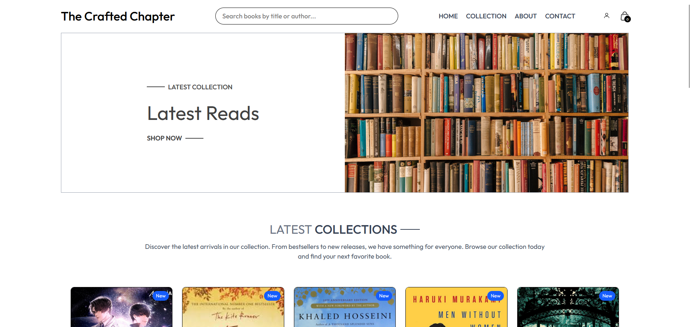

# 📚 The Crafted Chapter | Modern Online Bookstore

A sophisticated online bookstore built with React, TypeScript, and Tailwind CSS. Experience a seamless book shopping journey with a clean, intuitive interface and powerful search capabilities.



## ✨ Live Demo

[Visit The Crafted Chapter](https://thecraftedchapter.netlify.app/)

## 🎯 Key Features

- 📱 Responsive design optimized for all devices
- 🔍 Real-time search with instant suggestions
- 📖 Detailed book previews and information
- 🛒 Intuitive shopping cart management


## 🛠️ Tech Stack

- **Frontend Framework:** React 
- **Type System:** TypeScript
- **Styling:** Tailwind CSS 
- **Build Tool:** Vite 
- **Routing:** React Router DOM 
- **Notifications:** React Toastify
- **State Management:** React Context API
- **Development:** ESLint, Prettier

## 🚀 Getting Started

1. **Clone the repository**
```bash
git clone https://github.com/yourusername/the-crafted-chapter.git
```

2. **Install dependencies**
```bash
cd the-crafted-chapter
npm install
```

3. **Start development server**
```bash
npm run dev
```

4. **Build for production**
```bash
npm run build
```

## 📂 Project Structure

```
the-crafted-chapter/
├── src/
│   ├── assets/        # Static assets and images
│   ├── components/    # Reusable UI components
│   ├── context/      # React Context providers
│   ├── data/         # Static data and configurations
│   ├── hooks/        # Custom React hooks
│   ├── pages/        # Page components
│   ├── styles/       # Global styles and Tailwind config
│   ├── types/        # TypeScript type definitions
│   ├── utils/        # Helper functions and utilities
│   ├── App.tsx       # Root component
│   └── main.tsx      # Entry point
├── public/           # Public assets
└── package.json      # Project dependencies and scripts
```

## 📱 Features in Detail

- **Smart Search**
  - Real-time search suggestions
  - Search by title, author, or genre
  - Instant results preview

- **Shopping Experience**
  - Intuitive cart management
  - Quantity adjustments
  - Price calculations
  - Order summary

- **User Interface**
  - Responsive design
  - Dark mode support
  - Loading states
  - Error handling
  - Toast notifications

## 👤 Author

Your Name
- GitHub: [@yourusername](https://github.com/PerfAct-Flip)
- LinkedIn: [Your Profile](https://linkedin.com/in/soham-sinha-pf)

## 🙏 Acknowledgments

- Book cover images from various publishers
- Icons from Heroicons
- UI inspiration from modern e-commerce platforms


